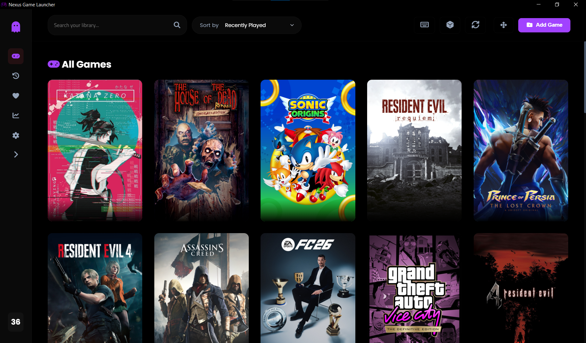
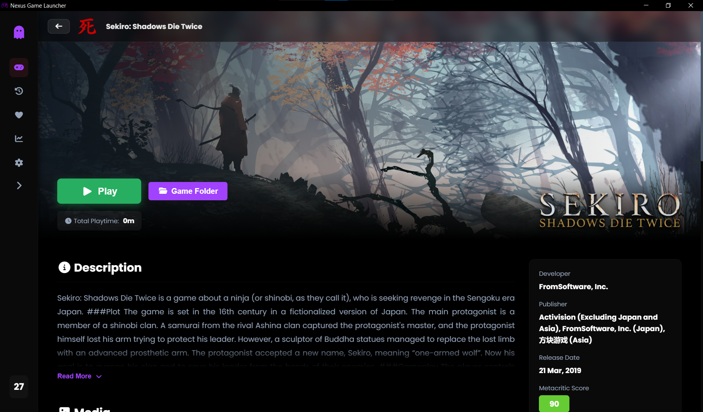
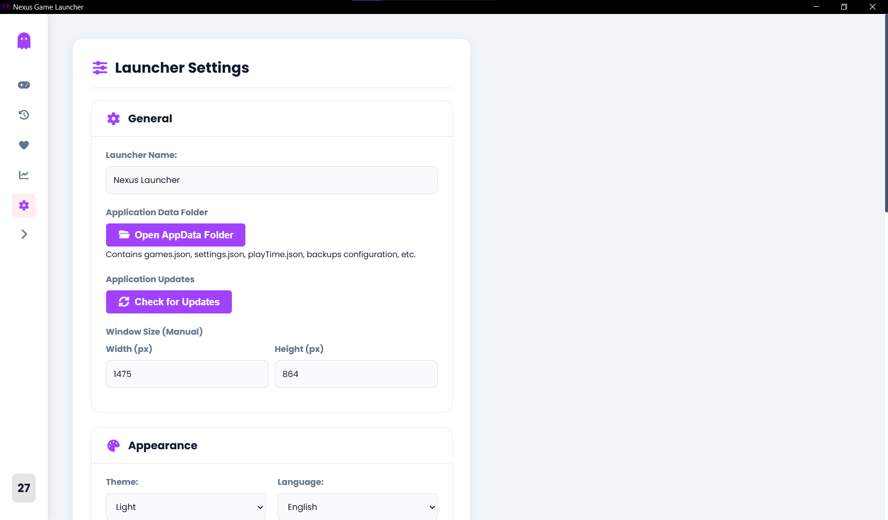
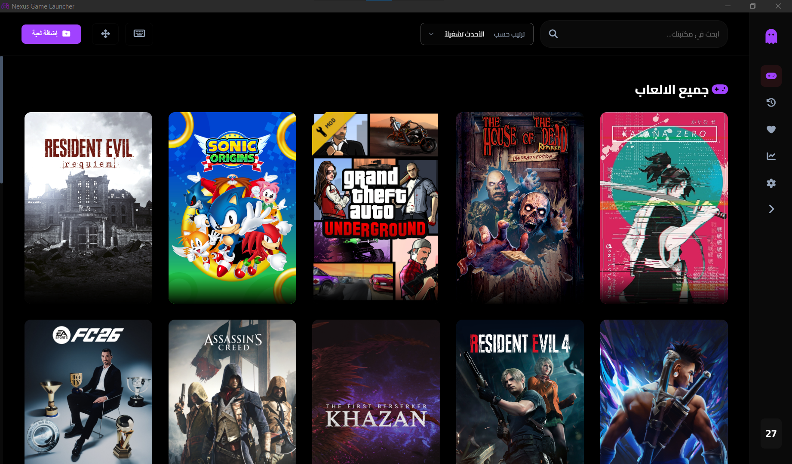

# Nexus Game Launcher `v1.6.0`

[](https://www.electronjs.org/)
[](https://github.com/AliAl-ojeely)
[](LICENSE)
[](https://github.com/AliAl-ojeely)

<br>

<p align="center">
  
</p>

<br>

**Nexus Game Launcher** is a sophisticated desktop application built with the **Electron** framework. It provides a cinematic, organized, and high-performance interface to manage and launch locally installed PC games, bridging the gap between your local files and the **Steam Store** ecosystem.

---

# What's New in v1.6.0

The game details experience has been redesigned to provide a more immersive and cinematic interface.

<p align="center">
  
</p>

### Improvements

- **Cinematic Hero Banners**  
  Dynamic background rendering in the game details page with medium-opacity overlays for a premium visual experience.

- **Enhanced Steam Integration**  
  Automatically fetches game metadata including description, developer, publisher, and release date.

- **Interactive Media Hub**  
  Built-in video trailer support with a custom **Image Lightbox / Slideshow** for high-resolution screenshots.

- **System Requirements Module**  
  Displays minimum and recommended PC requirements directly from the Steam database.

- **Developer Info Modal**  
  Interactive "About Developer" window triggered by clicking the application logo with floating animations and external social links.

---

# Features Snapshot

Explore the core organization and customization features available in the launcher.

---

## Organize Your Library

Effortlessly manage your collection with dedicated views for your entire library and favorite games.

<p align="center">
  
</p>

---

## Full Customization & Localization

Customize the experience with theme settings, adjustable layouts, and full **Arabic RTL support**.

<br>

<p align="center" style="display:flex; justify-content:center; gap:15px; flex-wrap:wrap;">
  
  
</p>

<br>

### Core Features

- **Local Library Management**  
  Add and organize executable files (`.exe`, `.bat`, `.lnk`) from your system.

- **Hybrid Cover System**  
  Retrieve covers automatically from the Steam store or manually select custom posters.

- **Favorites & Search**  
  Quickly filter your library and pin your most-played games.

- **Customizable UI**  
  Supports Dark/Light themes, adjustable grid sizes, and bilingual interface (**Arabic / English**).

- **Persistent Local Storage**  
  Lightweight JSON-based database keeps all data stored locally on the user's machine.

- **Secure Execution Environment**  
  Uses Electron IPC communication and context isolation for safe desktop application behavior.

---

# Technology Stack

| Component | Technology |
|-----------|------------|
| Runtime | Electron JS |
| Frontend | HTML5, CSS3 (Flexbox / Grid), JavaScript (ES6+) |
| Icons | FontAwesome 6 |
| Data Fetching | Axios (Steam Web API Integration) |
| Persistence | Local JSON Database |
| Installer | Electron Builder (NSIS) |

---

# Installation & Development

Follow these steps to run the project locally.

---

# Clone the Repository

```bash
git clone https://github.com/AliAl-ojeely/mygamelauncher.git

```

# Navigate to the Project

```bash
cd mygamelauncher

```

# Install Dependencies

```bash
npm install
```

# Run the Application

```bash
npm start
```

# Building the Windows Installer

To generate a production-ready .exe installer:
```bash
npm run dist
```
The compiled installer will be located in the /dist directory.

---
# Developer

Ali Nasser Al-ojeely
Junior Software Developer | Frontend Specialist

Email
alialojeely@gmail.com

GitHub
@AliAl-ojeely