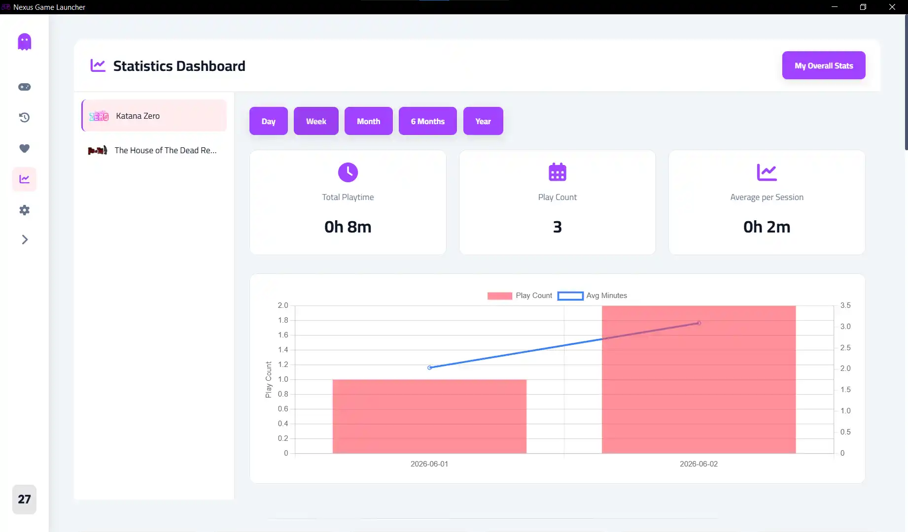
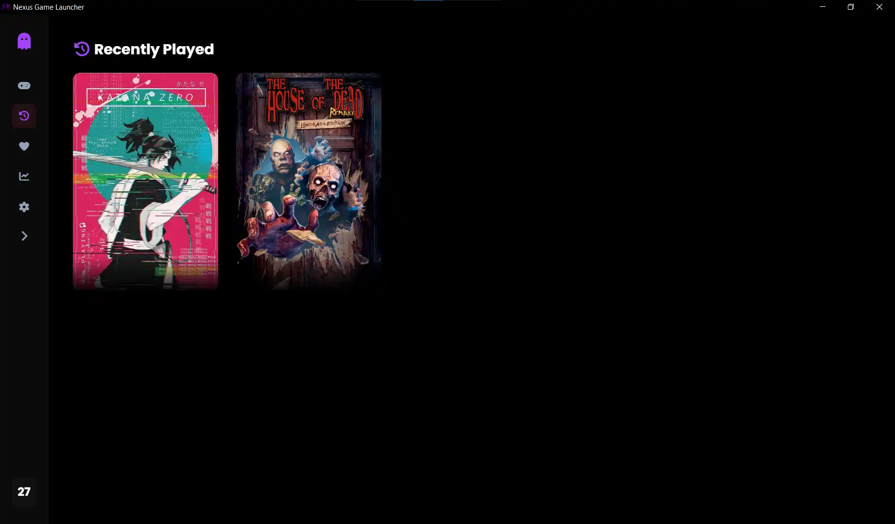
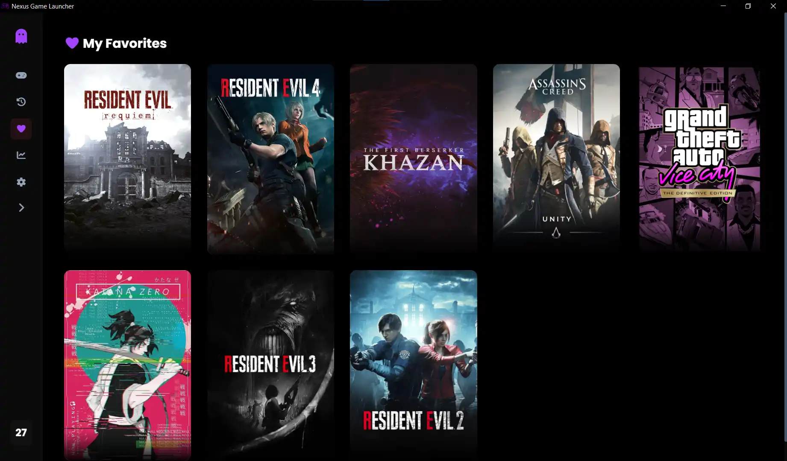
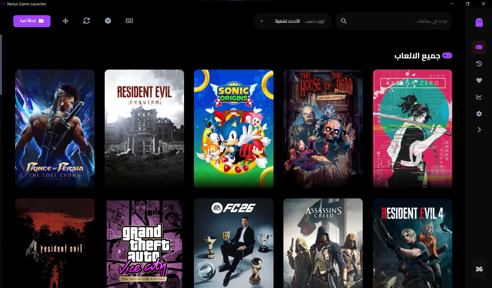

<div align="center">

# Nexus Game Launcher

[](https://www.electronjs.org/)
[](https://github.com/AliAl-ojeely)
[](LICENSE)
[](https://github.com/AliAl-ojeely)
[](https://github.com/AliAl-ojeely)

<br>


<br>

**Nexus Game Launcher** is a sophisticated desktop application built with the **Electron** framework that provides a cinematic, organized, and high-performance interface to manage and launch locally installed PC games.

*Starting from **version 1.6.0**, Nexus officially supports **Linux** through the **Proton compatibility layer**, allowing Windows-exclusive games to run with near-native performance.*

</div>

---

## What's New in `v2.6.0` – The "Insight & Control" Update

Version `2.6.0` introduces a complete **Game Statistics Dashboard**, library sorting, personal notes, folder details, and many UI/UX improvements.

### Game Statistics Dashboard

A powerful analytics page that tracks every gaming session:

- Total playtime, play count, average session length (per game or overall)
- Period filters: Day, Week, Month, 6 Months, Year
- Charts: daily play count + avg minutes, weekday distribution, hour distribution, top games, monthly playtime
- Session history table (last 20 sessions) and export to CSV
- Export current stats as PNG image (sharable)

<p align="center">
  
</p>

### 🎮 Library Sorting

Sort your games directly from the topbar:

- Name (A‑Z / Z‑A)
- Most played (by total playtime)
- Recently played (by last launch)

### 📝 Personal Game Notes

Add custom notes for each game (e.g., "finished on hard mode", "next boss strategy") – visible in the game details sidebar and stored locally.

### 📁 Folder Details in Game Sidebar

Like Windows folder properties, you now see:

- Folder name, type, location
- Total size, size on disk
- Number of files & folders
- Creation date

### 🔄 Recently Played Limit

Choose how many games appear in the "Recently Played" section (5, 10, 20, 50) – accessible in Settings.

### ⚡ Update Checker with Download Progress

The built‑in update checker now shows a download progress bar and allows cancellation. The entire update process is more transparent.

<p align="center">
  
</p>

### 🖼️ Recently Played Section (Redesigned)

The “Recently Played” view now correctly uses session timestamps and respects the user‑defined limit. Action buttons on recent cards are replaced with a clean “Remove from recent” icon.

<p align="center">
  
</p>

### Technical Overhauls

- **Session Logging** – Every game launch is recorded in `playSessions.json`, enabling accurate playtime analytics.
- **Modular Statistics Page** – New `render/stats.js` with Chart.js visualisations.
- **Sort Dropdown in Topbar** – Replaces the previous separate bar, saving screen space.
- **Sidebar Collapse Button** – Toggle sidebar to icon‑only mode (state saved).
- **CSP Fixes** – Allowed `html2canvas` and `cdnjs.cloudflare` for PNG export.
- **Darker Mode Borders** – Improved border visibility in darker theme.

---

## Features Snapshot

### Organize Your Library

Effortlessly manage your collection with dedicated views for your **entire library** and **favorite games**.  
**New:** Sort by name, playtime, or recent play – or drag & drop to reorder manually.

<p align="center">
  
</p>

### Game Details View

Immerse yourself in a cinematic game overview with dynamic banners, animated logos, screenshots, trailers, and system requirements – all beautifully laid out.

<p align="center">
  
</p>

### Full Customization & Localization

Customize the experience with dark/light/darker themes, adjustable grid layouts, and full **Arabic RTL support**.  
**New:** Edit every visual asset (poster, logo, background, icon) – and remove them to revert to auto‑downloaded versions.

<p align="center">
  
  
</p>

### Game Statistics Dashboard

Gain deep insights into your gaming habits with interactive charts and exportable data.

<p align="center">
  
</p>

### Recently Played (Improved)

See your most recently launched games at a glance, with the ability to remove entries from the list without deleting the game.

<p align="center">
  
</p>

### Update Checker with Download Progress

Never miss a new version – the built‑in updater shows download progress and lets you cancel mid‑download.

<p align="center">
  
</p>

---

## Core Features

- **Cross-Platform Execution:** Native support for **Windows** and specialized **Proton support for Linux** systems.
- **Local Library Management:** Add and organize executable files (`.exe`, `.bat`, `.lnk`) effortlessly.
- **Hybrid Asset System:** Retrieve posters, logos, backgrounds, and icons automatically (SteamGridDB + RAWG + Steam) or override them with your own images.
- **Favorites & Search:** Quickly filter your library and pin your most-played games.
- **Smart Launch & Playtime Tracking:** Prevents accidental double‑launches while accurately logging total playtime (localised to H/M or س/د), backed by an intelligent process monitor.
- **Automatic & Manual Backups:** Secure your game saves with one‑click backups and restore any previous backup directly from the launcher.
- **Persistent Local Storage:** A lightweight JSON‑based database keeps all your data (including custom order and session logs) entirely local and private.
- **Secure Execution Environment:** Built with Electron IPC communication and context isolation for secure desktop behaviour.

---

## 🐧 Linux Support & Requirements

To ensure Windows games run smoothly on **Linux (Arch / EndeavourOS)**, install the following prerequisites:

### 1. GPU Drivers

**NVIDIA**

```bash
sudo pacman -S lib32-nvidia-utils lib32-vulkan-icd-loader

```

**AMD**

```bash
sudo pacman -S lib32-vulkan-radeon lib32-mesa
```

**Proton GE**

Place your Proton build inside:

```bash
~/Nexus-Proton/GE-Proton10-32/
```

**Audio Support**

```bash
sudo pacman -S lib32-libpulse lib32-pipewire
```

# Running the AppImage (Linux)

If you downloaded the AppImage version:

Method 1 — File Manager

Right-click the file

Open Properties

Enable Allow executing file as program

Method 2 — Terminal

```bash
chmod +x Nexus_Game_Launcher_1.7.0.AppImage./Nexus_Game_Launcher_1.7.0.AppImage
```

---

## Technology Stack

| Component | Technology |
|:---|:---|
| **Runtime** | Electron JS (v41+) |
| **Backend** | Node.js (Child Process, IPC, FS) |
| **Frontend** | HTML5, CSS3 (Flexbox/Grid), JavaScript (ES6 Modules) |
| **Drag & Drop** | SortableJS (CDN) |
| **Modular Architecture** | Custom ES6 Modules (`render/details/`, `render/modal/`) |
| **Compatibility** | Proton GE (Linux) / Native (Windows) / macOS |
| **Data Fetching** | Axios (Steam, RAWG, SteamGridDB, YouTube APIs) |
| **Security & Secrets** | Bundled JSON Secrets (Injected via CI/CD Pipeline) |
| **Persistence** | Local JSON Database (`games.json`, `playTime.json`, `gamesBackSave.json`, `order.json`) |
| **Backup System** | adm‑zip (ZIP compression) |
| **Assets & UI** | Localized FontAwesome 6 & Google Fonts (100% Offline Support) |
| **CI/CD & Build** | GitHub Actions Pipeline → Electron Builder (NSIS, AppImage, DMG) |

# Project Structure

```bash

NEXUS-GAME-LAUNCHER/
├── .github/
├── assets/
│   ├── fonts/
│   ├── fontawesome/
│   ├── favorites-view.webp
│   ├── game-details-cinematic.webp
│   ├── icon.ico
│   ├── icon.png
│   ├── icon.icns
│   ├── icon-white.png
│   ├── main-library-ar.webp
│   ├── main-library-en.webp
│   ├── settings-page.webp
│   ├── check-for-updates-downloader.webp   
│   ├── recently-played.webp                
│   └── statistics-dashboard.webp           
├── css/
│   ├── components-layout.css
│   ├── backup-ux.css
│   ├── main.css
│   ├── modals.css
│   ├── pages.css
│   ├── reorder.css
│   └── variables.css
├── dist/
├── modules/
│   ├── app-settings.js
│   ├── app-tray.js
│   ├── assets.js             
│   ├── backup.js
│   ├── database.js
│   ├── dialogs.js
│   ├── updater.js
│   ├── game-launcher.js
│   ├── playSessions.js
│   ├── metadata.js           
│   ├── playtime.js
│   ├── rawg-api.js
│   ├── steam-api.js
│   ├── steamGrid-api.js
│   └── youtube-api.js
├── node_modules/
├── render/
│   ├── details/                     ← modular details page
│   │   ├── index.js
│   │   ├── state.js
│   │   ├── helpers.js
│   │   ├── render.js
│   │   ├── handlers.js
│   │   ├── page.js
│   │   └── init.js
│   ├── modal/                       ← modular edit modal
│   │   ├── index.js
│   │   ├── helpers.js
│   │   ├── backup-status.js
│   │   ├── backup-fields.js
│   │   ├── add-game.js
│   │   ├── edit.js
│   │   └── init.js
│   ├── details.js                   ← re‑export
│   ├── modal.js                     ← re‑export
│   ├── backup-ui.js
│   ├── details-utils.js
│   ├── details-components.js
│   ├── library.js
│   ├── reorder.js
│   ├── render-main.js
│   ├── shortcuts.js
│   ├── state.js
│   ├── stats.js
│   └── ui.js
├── src/
│   ├── ipc/                 
│   │   ├── ipc-api.js        
│   │   ├── ipc-backup.js     
│   │   └── ipc-database.js   
│   ├── main.js               
│   ├── preload.js
│   ├── secrets.json
│   └── translation.js
├── .gitignore
├── games.json
├── games.json.example
├── index.html
├── package-lock.json
├── package.json
└── README.md

```

# Installation & Development

Clone the Repository

```bash
git clone https://github.com/AliAl-ojeely/nexus-game-launcher.git
```

Navigate to the Project

```bash
cd nexus-game-launcher
```

Install Dependencies

```bash
npm install
npm install axios
```

Run the Application

```bash
npm start
```

---

# Building for Production

**Windows (.exe)**

```bash
npm run dist-win
```

**Linux (AppImage)**

```bash
npm run dist-linux
```

Compiled files will appear inside the /dist directory.

---

# Developer & Contact

**Ali Nasser Al-ojeely (Mr.Ghost)** *Junior Software Developer | Frontend Specialist*

[](https://github.com/AliAl-ojeely)
[](mailto:alialojeely@gmail.com)

If you have any suggestions, encounter bugs, or want to contribute, feel free to open an issue or reach out directly!
